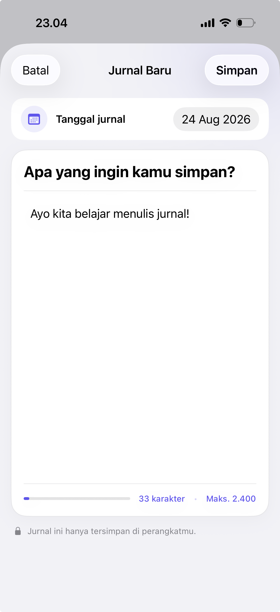

  

<h1 align="center">MaiJur</h1>

  A private, on-device journal for capturing daily moments and turning them into thoughtful personal insights.

MaiJur is a native iPhone journaling app built with SwiftUI, SwiftData, and
Apple Foundation Models. Journals stay on the device, require no account, and
remain fully usable when generative features are unavailable.

## Screenshots

<table>
  <tr>
    <td align="center"><strong>Journals</strong></td>
    <td align="center"><strong>Write</strong></td>
    <td align="center"><strong>Journal insight</strong></td>
    <td align="center"><strong>Overall insight</strong></td>
  </tr>
  <tr>
    <td></td>
    <td></td>
    <td></td>
    <td></td>
  </tr>
</table>

## Features

- Create, read, edit, and delete journals stored locally with SwiftData.
- Write up to 2,400 characters with a visible character counter.
- Generate an on-device story summary, personal reflection, and main themes for
  an individual journal.
- Build an incremental overall insight from previously generated journal
  insights without repeatedly sending raw journal history to the model.
- Use the complete journaling flow without an account, server, or internet
  connection.
- Native light and dark appearances, Dynamic Type support, and VoiceOver-aware
  controls.

## How insights work

MaiJur keeps model tasks small and focused. Per-journal summary and reflection
use separate `LanguageModelSession` instances. The reflection addresses the
writer as “you” and stays grounded in the current journal.

Overall insight is generated from saved per-journal insights, not the entire
raw journal archive. It processes at most three new insights per batch and
combines them with the previous overall result, prioritizing newer evidence.
Editing a journal invalidates its old insight so the updated entry can be
analyzed again.

All model processing is performed through Apple's on-device Foundation Models
framework. Journal content is not sent to an application server or written to
production diagnostic logs. Debug builds intentionally print complete local
pipeline traces to the Xcode console for development; these traces are compiled
out of Release builds.

## Requirements

- Xcode 26.5 or newer
- iOS 26.5 or newer
- An Apple Intelligence-compatible device with Apple Intelligence enabled for
  insight generation

The core journal experience also runs when Foundation Models are unavailable.
Generated insights use English as an internal processing language and are
translated to Indonesian before they are saved for display. Journals written
in other languages are translated to English for processing first.

## Run locally

1. Clone the repository.
2. Open `Maijur.xcodeproj` in Xcode.
3. Select an iPhone target and run the `Maijur` scheme.

The simulator supports the journaling UI, persistence, and automated tests.
Test Foundation Models output on a compatible physical device.

## Technical overview

- **UI:** SwiftUI
- **Persistence:** SwiftData
- **Generation:** Apple Foundation Models with guided `@Generable` output
- **State:** Observation
- **Diagnostics:** OSLog metadata and DEBUG-only full pipeline traces
- **Dependencies:** Apple frameworks only

Product requirements, architecture decisions, and completed goals live in
[`docs/`](docs/README.md). The Foundation Models design is documented in
[`docs/specs/004-foundation-models.md`](docs/specs/004-foundation-models.md).

## Verification

The initial G0–G5 personal-project MVP verification is complete. The focused
Indonesian-output follow-up is in review pending target-device validation. The
unit and UI suites previously passed on an iOS 26.5 iPhone 17 simulator.
Recorded development measurements include an average simulator launch time of
`0.85 s`, a responsive 500-entry journal list, and approximately `4 s` for a
normal per-journal Foundation Models run on an iPhone 17.

See the detailed [quality verification record](docs/goals/G5-quality.md).

## Current scope

MaiJur intentionally has no account, cloud sync, analytics, export, or
third-party dependencies. It is a focused personal project centered on private
journaling and on-device reflection.
